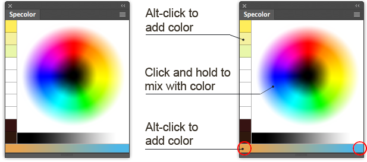

# Specolor

Specolor is yet another color mixer for Adobe Photoshop. The point of this is that it allows continuos mixing. Click and hold somewhere on palette and current color will start to shift towards selected color.

Said color picker doesn't replace standard Photoshop's picker but they work great in pair.

# Usage

Extension is not yet published in Adobe Addons store and is not signed, so in order to use you'll have to:

### Without building
* enable [debug mode](https://github.com/Adobe-CEP/CEP-Resources/blob/master/CEP_8.x/Documentation/CEP%208.0%20HTML%20Extension%20Cookbook.md#debugging-unsigned-extensions) (ouch) in Photoshop
* download [latest release](https://github.com/Reeywhaar/specolor/releases/download/0.1.0/Specolor.zip), unzip it, and copy to Photoshop [extensions directory](https://github.com/Adobe-CEP/CEP-Resources/blob/master/CEP_8.x/Documentation/CEP%208.0%20HTML%20Extension%20Cookbook.md#extension-folders)

### With building
* have `imagemagick` installed on your system
* enable [debug mode](https://github.com/Adobe-CEP/CEP-Resources/blob/master/CEP_8.x/Documentation/CEP%208.0%20HTML%20Extension%20Cookbook.md#debugging-unsigned-extensions) (ouch) in Photoshop
* build extension by running `make build` command in terminal.
* copy `build` directory to Photoshop [extensions directory](https://github.com/Adobe-CEP/CEP-Resources/blob/master/CEP_8.x/Documentation/CEP%208.0%20HTML%20Extension%20Cookbook.md#extension-folders) (for Mac users convenience command `make install` available)